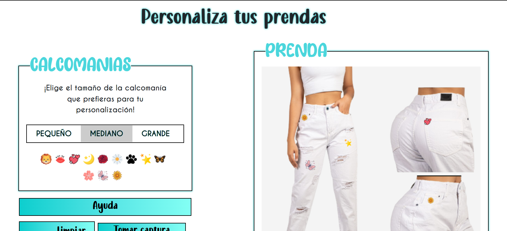

<h1 align="center"> D'Gaudy </h1>
<h4 align="center">Sistema de Información para la Personalización y Pedidos de Prendas de Jean </h4>

 

 

## Construido con 🛠️

_Herramientas Utilizadas_

* [Java](https://www.oracle.com/co/java/)
* [Html](https://developer.mozilla.org/es/docs/Web/HTML)
* [Css](https://developer.mozilla.org/es/docs/Web/CSS)
* [JavaScript](https://developer.mozilla.org/es/docs/Web/JavaScript)
* [MySQL](https://www.mysql.com/)

## Autores ✒️

* **Laura Romero** - *Diseñadora FrontEnd y Analista de Bases de Datos * - [LauraRomero](https://github.com/LauraRomero2704)
* **Yuliana Narvaez** - *Diseñadora BackEnd y Analista de Funcional * - [YulianaNarvaez](https://github.com/yuliana97)
* **Juan Romero** - *Diseñadora BackEnd y Analista de Requisitos * - [JuanRomero](https://github.com/JuanRomero08)
